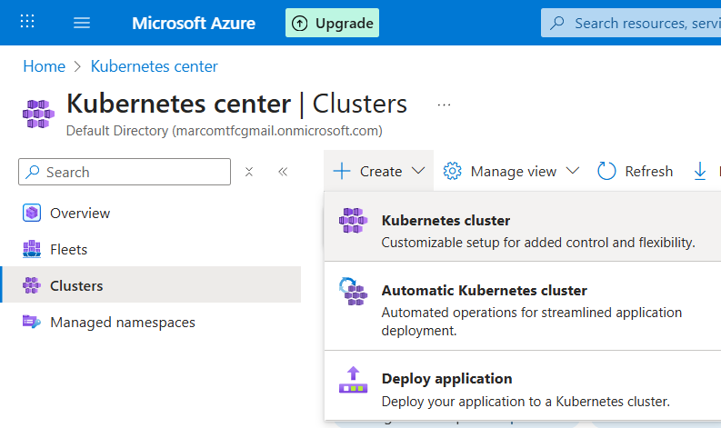

Let's start to build your laboratory. 🏗️

Head over to the Azure Portal, search for **Kubernetes services**, and click **Create** $\rightarrow$ **Kubernetes cluster**.



You should be landing on the **Basics** tab. This is where the physical architecture (and the bill) is defined. Before we move to the networking deep dive, we have to lock in our **FinOps** strategy so this cluster doesn't eat your wallet.

We want to simulate a Production environment, but we need to run it on "hardware" that costs peanuts.

1.  **Project details:** Create a new Resource Group (e.g., `rg-learning-aks`).
2.  **Cluster details:**
    * **Cluster preset configuration:** Switch this to **Dev/Test**.
    * **Availability zones:** Set this to **None** (Zones replicate data across data centers—expensive for a lab!).

Now, look at the **Node size** field. Even in "Dev/Test" mode, Azure often defaults to a general-purpose machine (like a D-series) which can cost ~$50/month.

Click on **"Select a size"** and look for the **B2s** (Burstable) series machines.

A "Burstable" (B-series) node is perfect for a learning lab, but dangerous for a real high-traffic production app.

* **For your Lab:** You will likely work for 2 hours (high CPU usage) and then read documentation for 30 minutes (0% usage). B-series VMs build up "credits" when they are idle. You then "spend" those credits to burst to 100% speed when you need to run a deployment. It's perfect for intermittent learning.
* **For Production:** If a real application has constant high traffic (e.g., an API receiving 500 req/sec), it never gets a chance to "rest" and accumulate credits. Once the credits run out, Azure throttles the CPU to a baseline (often 20-40% performance), causing your app to suddenly become incredibly slow.

Then, verify your **Node count** is set to **1** (Manual scale) to keep costs minimal.

### **A Note on that $30.37 Price Tag**

You might have noticed the column says **$30.37/month**. Don't panic—that assumes you leave it running 24 hours a day, 7 days a week.

* **The "Forgetful" Cost:** $30/month (Running 24/7).
* **The "Expert" Cost:** ~$7/month (Running 15 hours/week).

Since we will automate stopping the cluster, you will pay closer to the expert price.

------------------------
**Do not select the machine `Standard_B2pls_v2`.** 🛑

That little **"p"** in the name stands for the **Ampere Altra Arm64** processor.

While Arm64 chips (like the ones in newer MacBooks) are great, they are a "trap" for your specific learning path right now:
* **The Problem:** Most Docker tutorials and Helm charts default to building for **x86/Intel** chips. If you try to deploy a standard x86 container to this Arm64 node, it will crash with an error like `Exec format error`.
* **The Fix:** You want an **x86 (Intel or AMD)** processor so every tutorial just works.

### **The Better Choice: `Standard_B2als_v2`**
* **Name:** **`Standard_B2als_v2`**
* **Specs:** 2 vCPU, 4 GiB RAM.
* **Cost:** ~$27.45/month.
* **Why:** The **"a"** stands for **AMD**. This is an x86 chip that is fully compatible with standard Docker containers.

**Go to the Networking Tab:**
On the Networking tab, under **Network configuration**, what is selected by default?
* **Kubenet**?
* **Azure CNI Node Subnet**?
* **Azure CNI Overlay**?

(This setting decides how every pod gets its IP address, so it's critical we pick the right one for an "Expert" track.)
------------------------

Currently, you have **Network Policy** set to **None**.
This is like building a secure office building but putting no locks on the internal doors. Once a hacker (or a buggy script) gets inside the front door, they can talk to *any* database or service in the entire cluster.

To reach "Expert" level, we need to enforce **Zero Trust** security later in the year (Q4). To do that, we need a "security guard" installed now.

### **The Recommendation: Select "Calico"**

1.  **Why Calico?**
    * **Industry Standard:** Calico is used everywhere (AWS, Google Cloud, On-Premise). Learning "Azure Network Policies" only helps you in Azure. Learning **Calico** makes you a better Kubernetes engineer universally.
    * **The "Expert" Goal:** You mentioned a 10% focus on Security. Calico is the engine we will use to write rules like: *"The Frontend can talk to the Backend, but NOT to the Database directly."*
    * **No "Redeploy" Penalty:** If you choose "None" now, enabling policies later is painful (often requires rebuilding the cluster). Installing Calico now costs $0 extra (it's open source).

----------------------------
Once your laboratory is open for business, the cluster is running in Azure, but your local computer doesn't know how to talk to it yet. We need to download the "keys" (the KubeConfig file).

Here is your **Expert Workflow** for the rest of the session:

### **Step 1: Connect (Get the Keys)**

This command merges your new cluster's credentials into your local `~/.kube/config` file.

Run this in your terminal (replace the names if you used different ones):

```bash
az aks get-credentials --resource-group rg-learning-aks --name <your-cluster-name>
```

*(Tip: You can find the exact cluster name in the Portal if you forgot it.)*

### **Step 2: The "Pulse Check"**

Verify the connection and see the physical hardware you just provisioned.

```bash
kubectl get nodes -o wide
```

**What to look for (The Expert View):**

  * **STATUS:** It should say `Ready`.
  * **VERSION:** Note the Kubernetes version (likely 1.29 or 1.30).
  * **OS-IMAGE:** Confirm it says `Ubuntu` (since we chose Linux).
  * **KERNEL-VERSION:** This proves you are looking at the actual Linux kernel of the VM.

### **Step 3: The Money-Saving Command (Critical)** 💰

Before you finish for today, you **must** run this command to stop the billing meter. This pauses the Control Plane and the Node (VM), so you stop paying for the compute hours.

```bash
az aks stop --name <your-cluster-name> --resource-group rg-learning-aks
```

*(It takes a few minutes to stop. When you want to work again, just run `az aks start ...`)*

-----

**Next Step for You:**
Run the commands in Step 1 and Step 2.
**Does `kubectl get nodes` return a status of `Ready`?**

If yes, you have successfully built a cloud-native landing zone\! We can deploy your first "test" application in the next message to verify that **Calico** network policy is actually working.

-------------------

You now have the "Control Tower" (your laptop) fully configured to talk to the "Data Center" (Azure).

Since your cluster is currently **Stopped** (saving money), running commands like `kubectl get nodes` will fail with a timeout. We don't want to wake it up *just* to look at it.

Instead, we are going to adopt a **"Code First, Deploy Later"** workflow. This is how experts work: we write the manifest files locally, check them, and then only wake up the cloud resources when we are ready to apply the changes.

Here is your mission for the next 10 minutes: **Prepare your first "Cloud Native" deployment.**

### **Step 1: Create the Manifest File**

We will create a file that defines a simple web server (Nginx). Since we chose **Azure CNI Overlay**, we will use a specific strategy to access it without buying an expensive Public IP.

1.  Create a new folder on your computer (e.g., `C:\k8s-lab`).
2.  Inside it, create a file named **`nginx-quickstart.yaml`**.
3.  Paste this "Expert Pattern" code into it:

<!-- end list -->

```yaml
apiVersion: apps/v1
kind: Deployment
metadata:
  name: nginx-deployment
  labels:
    app: nginx
spec:
  replicas: 2                 # We ask for 2 copies (High Availability)
  selector:
    matchLabels:
      app: nginx
  template:
    metadata:
      labels:
        app: nginx
    spec:
      containers:
      - name: nginx
        image: nginx:latest
        ports:
        - containerPort: 80
        resources:            # Expert Tip: Always define limits!
          limits:
            memory: "128Mi"
            cpu: "250m"
---
apiVersion: v1
kind: Service
metadata:
  name: nginx-service
spec:
  type: ClusterIP             # FREE (Internal only). No expensive LoadBalancer.
  selector:
    app: nginx
  ports:
  - port: 80
    targetPort: 80
```

### **Step 2: The "Dry Run" (Syntax Check)**

Even though the cluster is stopped, `kubectl` can still check if your YAML syntax is valid locally.

Open your terminal in that folder and run:

```bash
kubectl apply -f nginx-quickstart.yaml --dry-run=client
```

  * **Success:** It prints `deployment.apps/nginx-deployment created (dry run)`.
  * **Failure:** It will tell you exactly which line has a typo.

### **Step 3: The "Wake Up" Protocol** ⏰

If the dry run passed, and you have **10-15 minutes** free, we are ready to launch.

1.  **Start the Cluster:**

    ```bash
    az aks start --name <your-cluster-name> --resource-group rg-learning-aks
    ```

    *(This takes about 3-5 minutes. Go grab a coffee ☕)*

2.  **Verify It's Awake:**

    ```bash
    kubectl get nodes
    ```

    *(Wait until it says "Ready")*

3.  **Deploy:**

    ```bash
    kubectl apply -f nginx-quickstart.yaml
    ```

**Are you ready to wake it up now, or would you prefer to save the "Live Fire" exercise for tomorrow?**


This is actually "good" news—it confirms your cluster is indeed **Stopped** and saving you money\! 🛑💸

### **What Happened?**

Even when you run `--dry-run=client`, `kubectl` tries to be helpful by connecting to your specific cluster to download its "OpenAPI Schema" (the rulebook for that specific version of Kubernetes).

Since the cluster is off, the DNS name `learning-aks-lab-dns...` doesn't exist on the internet right now. Your computer tried to call the cluster, and nobody answered.

### **The Fix: Truly "Offline" Validation**

To check your YAML syntax without any network call, we need to be strict.

Run this command instead:

```bash
kubectl apply -f nginx-quickstart.yaml --dry-run=client --validate=false
```

  * **--dry-run=client**: "Don't send this to the server."
  * **--validate=false**: "Don't ask the server for the rulebook; just check the basic YAML structure."

### **Decision Time: Wake Up or Wait?**

Since it is **10:40 PM** where you are (Pittsburgh time), my advice:

**Wait until tomorrow.** 🛌

1.  **Save your credits:** No point paying for the spin-up time if you're about to sleep.
2.  **Fresh Start:** We can do the "Live Fire" deployment with a fresh mind tomorrow.
3.  **Homework (Optional):** If you want to feel productive, just create that `nginx-quickstart.yaml` file and save it. That way, you are ready to launch in 5 seconds when you sit down next time.
