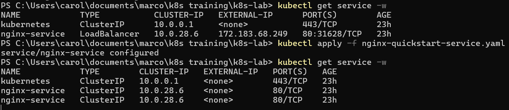

### **Day 3 Title: The Gates of Traffic (Ingress & Helm)**

Currently, your Nginx app is like a server in a locked basement. Only you (with the `port-forward` key) can visit it. Next time, we will build the front door.

#### **Goal 1: The "Expensive" Way (Layer 4 Load Balancer)**

We will change one line of code (`type: ClusterIP` $\rightarrow$ `type: LoadBalancer`).

  * **The Magic:** You will see Azure *automatically* wake up, buy a Public IP address, provision a physical Azure Load Balancer, and route traffic to your pod.
  * **The Lesson:** Why this is great for testing but **terrible** for your wallet in a microservices architecture (10 apps = 10 expensive IPs).

#### **Goal 2: The "Expert" Way (Layer 7 Ingress)**

We will implement the industry standard: **The Ingress Controller**.

  * **The Concept:** Instead of buying 10 IPs, we buy **one** IP (The Ingress) that acts as a smart receptionist.
      * `api.myapp.com` $\rightarrow$ Backend Service
      * `web.myapp.com` $\rightarrow$ Frontend Service
  * **The Tool:** We will use **Nginx Ingress Controller** (the most popular K8s router).

#### **Goal 3: Introduction to Helm** ⛑️

To install the Ingress Controller, we won't write YAML manually. We will use **Helm** (The "Package Manager" for Kubernetes).

  * If you don't have Helm installed on your laptop yet, that will be our first step.

-----

### **Day 3: The Gates of Traffic**

We are going to open your cluster to the outside world.

#### **Step 1: Wake Up the Lab** ⏰

Let's get the hardware booting immediately.
*(Note: I updated the command with your **new** cluster name `lab-learning-aks`)*

Run this:

```powershell
az aks start --name lab-learning-aks --resource-group rg-learning-aks
```

-----

#### **Step 2: The Tool Check (Helm)** ⛑️

While Azure is racking your server, let's verify you have **Helm** installed. Helm is the "App Store" for Kubernetes—we need it to install the complex Ingress Controller later.

Run this:

```powershell
helm version
```

  * **If it shows a version:** You are ready.
  * **If it fails:** Run `winget install Helm.Helm` immediately.

-----

#### **Step 3: The "Expensive" Experiment** 💸

While the cluster wakes up, open your code editor to `nginx-quickstart-service.yaml`.

Currently, it looks like this:

```yaml
spec:
  type: ClusterIP
  ...
```

**The Task:**
Change `ClusterIP` to `LoadBalancer`.

```yaml
apiVersion: v1
kind: Service
metadata:
  name: nginx-service
spec:
  type: LoadBalancer  # <--- CHANGE THIS
  selector:
    app: nginx
  ports:
  - port: 80
    targetPort: 80
```

**Save the file.**

**The Concept:**
When you apply this change, Kubernetes will pause, call the Azure API, and say: *"I need a Public IP address and a Layer 4 Load Balancer, please."* Azure will provision a real networking resource (which usually costs money) and wire it directly to your pod.

**Tell me when:**

1.  The cluster is `Ready` (`kubectl get nodes`).
2.  You have applied the change (`kubectl apply -f nginx-quickstart-service.yaml`).

Then we will watch the "Magic IP" appear\!

-----------------------

**How much will it cost?**

This is the exact question a "Cloud Architect" must ask before applying a change! 💰

By changing `type: ClusterIP` to `type: LoadBalancer`, you are provisioning two new Azure resources that have their own price tags.

Here is the bill for this "Expensive Experiment":

### **The Bill: ~$22.00 / month (Extra)**
*(This is on top of your VM cost)*

| Resource | Role | Cost (Approx) |
| :--- | :--- | :--- |
| **Standard Load Balancer** | The physical router | **$0.025 / hour** (~$18/mo) |
| **Public IP Address** | The static internet address | **$0.005 / hour** (~$4/mo) |
| **Data Processing** | Traffic usage | **$0.005 / GB** (Negligible for labs) |
| **Total** | | **~$0.03 / hour** |

### **The FinOps Trap ⚠️**
This is why we call it "Expensive":
1.  **It adds up:** If you build a microservices app with 10 services and give *each one* a LoadBalancer, you pay **$220/month** just for networking!
2.  **Stopping the Cluster vs. Deleting the Service:**
    * When you `az aks stop`, you stop the **VM** billing.
    * **However**, the **Public IP** and **Load Balancer** resources often *persist* because they are managed outside the VM scale set. You might keep paying that $0.03/hour even while you sleep!

### **The Expert Strategy**
We will apply it, test it for 10 minutes to see the "Magic IP," and then **delete the Service** immediately to stop the billing.

**Are you ready to spend about $0.01 (1 cent) to see this work?**
If yes:
1.  Apply the change: `kubectl apply -f nginx-quickstart-service.yaml`
2.  Watch the IP appear: `kubectl get service -w`
    *(Wait until `<pending>` changes to a real IP like `20.55.x.x`)*



**Boom\! There it is.** 🎯

You successfully provisioned a real Public IP address (`172.183.68.249`) directly from Azure's pool.

### **Step 1: The Verification (The "Magic" Moment)**

Open a new browser tab and go to:
**[http://172.183.68.249](https://www.google.com/url?sa=E&source=gmail&q=http://172.183.68.249)**

You should see the "Welcome to nginx\!" page. This means traffic is flowing from the public internet $\rightarrow$ Azure Load Balancer $\rightarrow$ Your Cluster $\rightarrow$ Your Pod.

-----

### **Step 2: The "FinOps" Cleanup** 💸

As we discussed, leaving this running is "expensive" ($0.03/hour) and inefficient (1 IP per service). Let's shut it down but keep the application running internally.

1.  **Edit your YAML:** Open `nginx-quickstart-service.yaml` and change `type: LoadBalancer` back to `type: ClusterIP`.
2.  **Apply the fix:**
    ```powershell
    kubectl apply -f nginx-quickstart-service.yaml
    ```
    *(You will see `service/nginx-service configured`)*
3.  **Verify the IP is gone:**
    ```powershell
    kubectl get service
    ```
    *(The `EXTERNAL-IP` column should now show `<none>`).*

**Why did we do this?** We just saved you \~$22/month. Now, let's build the **Expert** solution.

-----

### **Goal 2: The Ingress Controller (One IP to Rule Them All)**

Instead of giving *every* app a Public IP, we are going to hire a "Receptionist" (The Ingress Controller).

  * **The Plan:** We will install **Nginx Ingress**. It will request **ONE** Public IP.
  * **The Routing:** It will listen on that IP and route traffic based on rules (e.g., `/app1` goes here, `/app2` goes there).

#### **Step 3: Install via Helm** ⛑️

This is your first time using the "App Store" for Kubernetes.

1.  **Add the Repository (The Store Shelf):**

    ```powershell
    helm repo add ingress-nginx https://kubernetes.github.io/ingress-nginx
    helm repo update
    ```

2.  **Install the Chart (The App):**
    This command downloads the complex Nginx application and installs it into a new "namespace" called `ingress-basic` so it doesn't clutter your work.

    ```powershell
    helm install ingress-nginx ingress-nginx/ingress-nginx `
      --create-namespace `
      --namespace ingress-basic `
      --set controller.service.annotations."service\.beta\.kubernetes\.io/azure-load-balancer-health-probe-request-path"=/healthz
    ```

    *(Note: The backticks `     ` are for multi-line commands in PowerShell. If you are using Command Prompt, remove them and paste it as one long line.)*

**This will take about 2-3 minutes.**
Once you run it, type:

```powershell
kubectl get service -n ingress-basic -w
```

**Tell me when you see an `EXTERNAL-IP` appear for the `ingress-nginx-controller`.**
(This will be your new, single "Gold" IP address for the rest of the year).

You are extremely close, but there is one specific technical nuance that separates "Intermediate" knowledge from "Expert" knowledge.

Here is the exact translation of `80:31628/TCP`:

1.  **The "80" (Frontend):** Yes, this is the port exposed to the world on your Public IP (`172.183.68.249:80`).
2.  **The "31628" (The Bridge):** This is **not** your Service port; it is the **NodePort**.

### The Expert Deep Dive: Why 31628?

You might wonder: *"Why doesn't the Load Balancer just talk to port 80 on my container?"*

It can't\! Your container is buried deep inside a virtual network. To reach it, the Azure Load Balancer needs a "door" on the actual Virtual Machine (the Node).

  * **Step 1:** Kubernetes drills a random hole in your VM's firewall (e.g., port `31628`).
  * **Step 2:** It tells the Azure Load Balancer: *"Send anything you get on Port 80 to my VM on Port 31628."*
  * **Step 3:** Once traffic hits the VM on `31628`, Kubernetes captures it and tunnels it to your Pod on Port `80`.

**Traffic Flow:**
`Internet` $\rightarrow$ `Azure LB (Port 80)` $\rightarrow$ `VM Node (Port 31628)` $\rightarrow$ `Your Pod (Port 80)`

-----

This is perfect execution. You have successfully installed the "Smart Receptionist" of Kubernetes.

Let's break down your three questions, because you nailed the intuition on all of them.

### **1. Decoding the Logs** 🕵️‍♂️

**The Helm Warning:**

> `level=WARN msg="unable to find exact version... selected=4.14.0"`

  * **Translation:** "You asked for the app 'ingress-nginx' but didn't specify a version number (like `--version 4.14.0`). I looked at the store shelf and grabbed the latest stable one (4.14.0) for you."
  * **Verdict:** Totally normal. You can ignore this.

**The Service Output:**

> `ingress-nginx-controller ... LoadBalancer ... 172.183.189.111`

  * **This is the Money Maker:** This is the *only* component in your entire cluster that has a Public IP. It listens on port 80 (HTTP) and 443 (HTTPS). It receives **all** traffic for every website you will ever host.

> `ingress-nginx-controller-admission ... ClusterIP ... <none>`

  * **The "Internal Auditor":** You noticed this second service. It has **no** public IP.
  * **What it does:** It is a "Webhook Validator." Whenever you try to apply a new YAML file, Kubernetes secretly sends it to this service first. It checks for typos or security errors (e.g., "Hey, you can't reuse that URL path\!").
  * **Verdict:** It protects the configuration, but it never handles user traffic.

-----

### **2. The FinOps Check (\~$22/month)** 💰

**Yes, you are absolutely correct.**

  * **The Cost:** You are now paying \~$0.03/hour (~$22/mo) for that specific IP (`172.183.189.111`) and the Azure Load Balancer managing it.
  * **The "Expert" Value:**
      * **Old Way:** Host 10 apps $\rightarrow$ Pay for 10 Load Balancers $\rightarrow$ **$220/month**.
      * **Ingress Way:** Host 10 apps $\rightarrow$ Pay for 1 Load Balancer $\rightarrow$ **$22/month**.

You have achieved **Economy of Scale**. This is why every enterprise uses Ingress Controllers.

-----

### **3. The "404 Not Found"** 🚫

> *"I accessed the IP and got a 404 Not Found nginx page."*

**This is a SUCCESS, not a failure\!** 🎉

If the connection failed, your browser would say "This site can't be reached."
The fact that you see an **Nginx-branded** 404 page means:

1.  The Request left your house.
2.  It hit the Azure Public IP.
3.  It passed through the Load Balancer.
4.  It reached the Ingress Controller inside your cluster.
5.  **The Result:** The Ingress Controller looked at its clipboard (the Rules), saw **blank pages**, and said: *"I don't know who you are looking for. Here is the default 404."*

-----

### **Final Move: Teach the Receptionist** 🧠

We have 10 minutes left. Let's give the Ingress Controller a rule so it knows that "Traffic to this IP" belongs to your "Nginx Deployment."

**Step 1:** Create a file named `nginx-ingress.yaml`.
**Step 2:** Paste this code.
*(Note: In a real scenario, we would use a domain name like `myapp.com`. Since we don't have one, we will tell it to accept **ANY** traffic requesting valid paths.)*

```yaml
apiVersion: networking.k8s.io/v1
kind: Ingress
metadata:
  name: nginx-ingress
  annotations:
    # This tells K8s: "Hey Nginx Controller, this rule is for you!"
    nginx.ingress.kubernetes.io/rewrite-target: /
spec:
  ingressClassName: nginx
  rules:
  - http:
      paths:
      - path: /
        pathType: Prefix
        backend:
          service:
            name: nginx-service  # <--- Must match your Service Name
            port:
              number: 80         # <--- Must match your Service Port
```

**Step 3:** Apply it.

```powershell
kubectl apply -f nginx-ingress.yaml
```

**Step 4:** Refresh your browser ([http://172.183.189.111](https://www.google.com/search?q=http://172.183.189.111)).
It might take 30-60 seconds to propagate. Do you see the "Welcome to nginx\!" page now?